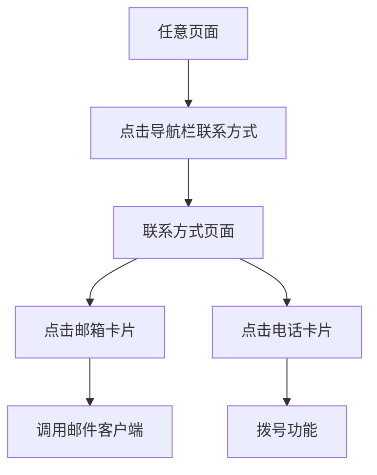

## 1. Product Overview
新增联系方式页面，作为网站的重要联系入口，与简历、作品集页面并列。该页面提供邮箱和电话两种联系方式，方便访客快速与网站所有者取得联系。

## 2. Core Features

### 2.1 User Roles
无需用户角色区分，所有访客均可访问联系方式页面。

### 2.2 Feature Module
联系方式页面包含以下核心模块：
1. **联系方式页面**：页面标题、背景样式、顶部大标题、两个半透明联系卡片（邮箱/电话）

### 2.3 Page Details
| Page Name | Module Name | Feature description |
|-----------|-------------|---------------------|
| 联系方式页面 | 页面标题 | 显示"联系方式"作为页面标题 |
| 联系方式页面 | 背景样式 | 与简历、作品集页面保持一致的背景设计 |
| 联系方式页面 | 顶部标题 | 显示大标题"CONTACT"，字体风格与现有页面一致 |
| 联系方式页面 | 邮箱联系卡片 | 显示邮件图标和邮箱地址，点击调用邮件客户端 |
| 联系方式页面 | 电话联系卡片 | 显示电话图标和电话号码，点击支持拨号功能 |
| 联系方式页面 | 导航菜单 | 在主导航栏添加联系方式选项，与简历、作品集并列 |

## 3. Core Process
访客访问流程：
1. 用户从任何页面通过主导航栏点击"联系方式"
2. 进入联系方式页面，看到顶部"CONTACT"标题
3. 页面中央显示两个半透明联系卡片
4. 用户可点击邮箱卡片调用邮件客户端，或点击电话卡片进行拨号

## 4. User Interface Design

### 4.1 Design Style
- 背景样式：与现有简历、作品集页面完全一致
- 卡片透明度：70%-80%，悬停时90%或添加阴影
- 图标大小：48px×48px，颜色与网站主题色一致
- 字体：与网站正文字体一致，字号16-18px
- 动画效果：0.3s平滑过渡

### 4.2 Page Design Overview
| Page Name | Module Name | UI Elements |
|-----------|-------------|-------------|
| 联系方式页面 | 顶部标题 | 大标题"CONTACT"，字体、字号、颜色与现有标题风格一致 |
| 联系方式页面 | 邮箱卡片 | 宽度300-350px，高度200-250px，半透明背景，邮件图标48px，邮箱地址文本 |
| 联系方式页面 | 电话卡片 | 与邮箱卡片相同尺寸，电话图标48px，电话号码文本 |

### 4.3 Responsiveness
采用桌面优先的响应式设计，确保在不同设备上背景显示效果统一，卡片布局自适应屏幕尺寸。

### 4.4 3D Scene Guidance
不适用