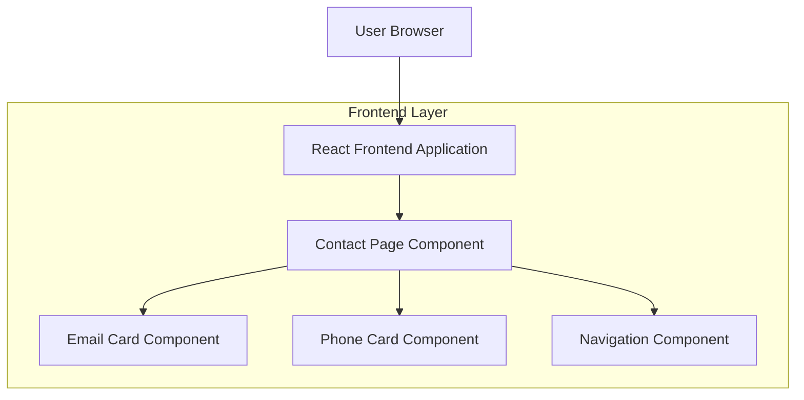

## 1. Architecture design

## 2. Technology Description
- Frontend: React@18 + tailwindcss@3 + vite
- Initialization Tool: vite-init
- Backend: None
- 图标库：lucide-react (用于邮件和电话图标)
- 路由：React Router DOM

## 3. Route definitions
| Route | Purpose |
|-------|---------|
| /contact | 联系方式页面，显示邮箱和电话联系方式 |
| / | 主页 |
| /resume | 简历页面 |
| /portfolio | 作品集页面 |

## 4. API definitions
不适用 - 联系方式页面为静态展示页面，无需API交互

## 5. Server architecture diagram
不适用 - 纯前端实现，无后端服务

## 6. Data model
不适用 - 联系方式页面为静态内容展示，无需数据模型